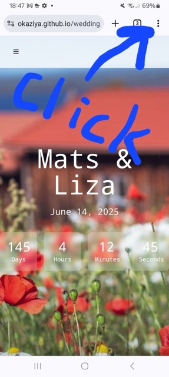
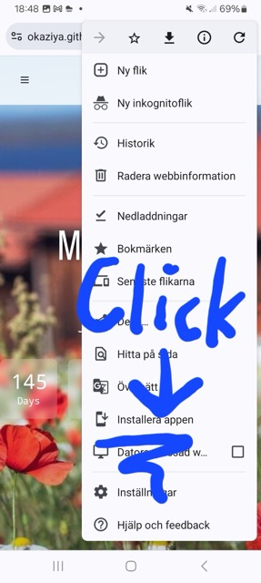
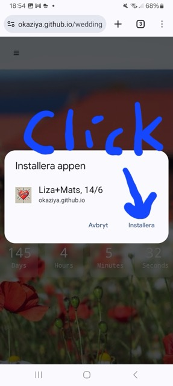
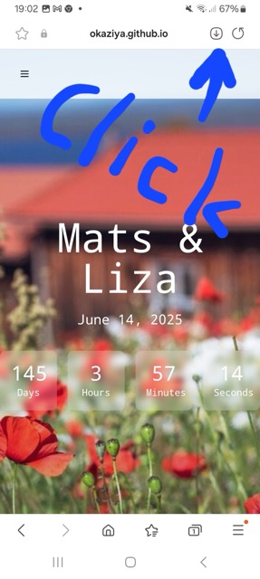
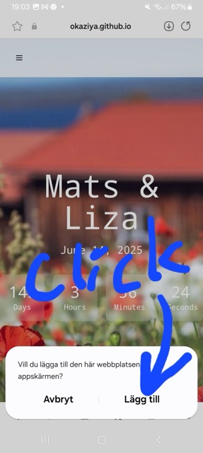
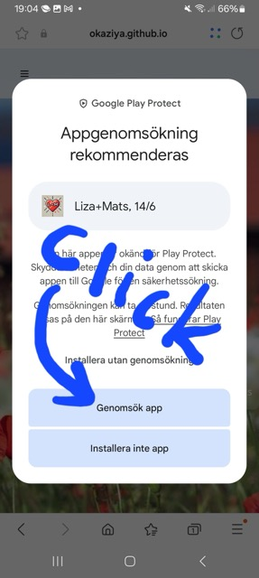
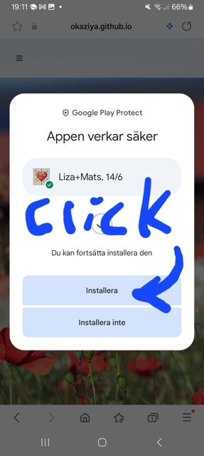
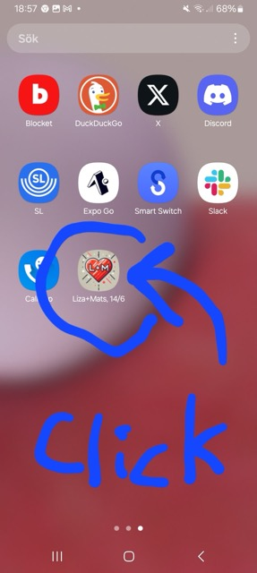
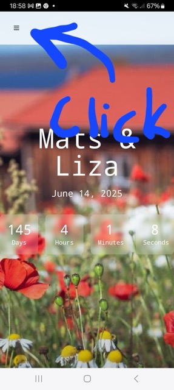
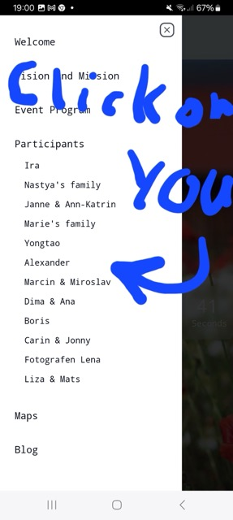

# How to add the _Liza+Mats Wedding Event App_ to your Android device

Open the web app in your Android web browser via the URL https://okaziya.github.io/wedding/ or by scanning
the following QR code:

Depending on your browser, the installation process may vary slightly. Below are the steps for Google Chrome ("Step 1a")
and the default Android Internet browser ("Step 1b").

## Step 1a: Install the app via Google Chrome browser on Android

Click the three dots in the top right corner of the browser window to open the context menu:

Click "Install app":

Confirm installing the "Liza+Mats, 14/6" app:

## Step 1b: Install the app via Android Internet browser

Click on the "Install" button left to the "Refresh" button at the top of the screen:

Confirm adding the app to your home screen:

Step through Google Play Protect by analyzing the app:

Confirm installing the "Liza+Mats, 14/6" app after Google Play Protect analysis passes:

## Step 2: Find the "Liza+Mats, 14/6" app on a home screen and open it

## Step 3: Open the "Liza+Mats, 14/6" app and press the menu button

## Step 4: Find your individual participant info via the menu

## Step 5: Enjoy the app! This is where you will find the most up-to-date information!

Check the _Blog_ page from time to time, for our planning progression toward the ceremony.

You look great today! 🎉
