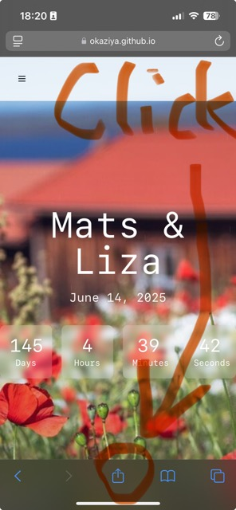
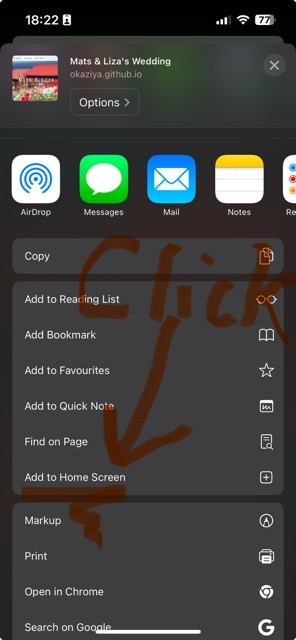
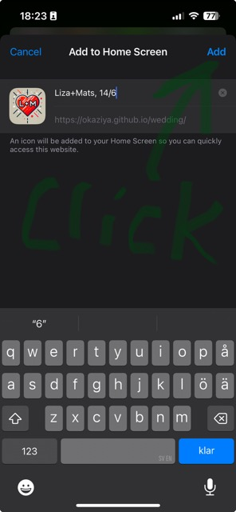
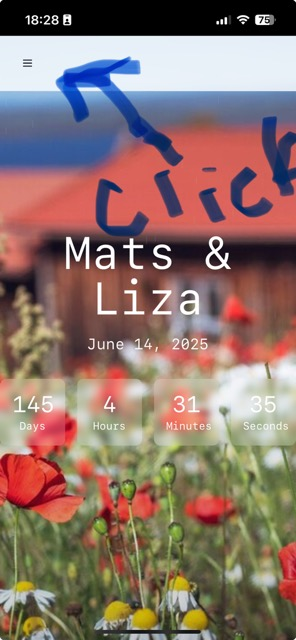
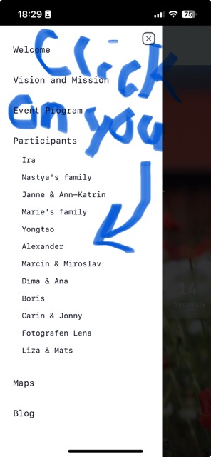

# How to add the _Liza+Mats Wedding Event App_ to your iPhone

Open the web app in your iPhone Safari browser via the URL https://okaziya.github.io/wedding/ or by scanning
the following QR code:

## Step 1: Click the "Share" button as depicted below

## Step 2: Click "Add to Home Screen"

## Step 3: Confirm the app name to use and click "Add"

## Step 4: Find the "Liza+Mats, 14/6" app on a home screen and open it

## Step 5: Open the "Liza+Mats, 14/6" app and press the menu button

## Step 6: Find your individual participant info via the menu

## Step 7: Enjoy the app! This is where you will find the most up-to-date information!

Check the _Blog_ page from time to time, for our planning progression toward the ceremony.

You look great today! 🎉
